# StyleSimplified

A simple and elegant desktop application built with JavaFX to help you digitize and manage your personal wardrobe, powered by a containerized PostgreSQL database.

---

## Table of Contents

- [About The Project](#about-the-project)
- [Application Showcase](#application-showcase)
- [Features](#features)
- [Built With](#built-with)
- [Getting Started](#getting-started)
  - [Prerequisites](#prerequisites)
  - [1. Running the Database Container](#1-running-the-database-container)
  - [2. Running the Application](#2-running-the-application)
- [Project Structure](#project-structure)
- [Future Improvements](#future-improvements)

---

## About The Project

StyleSimplified is a desktop app designed to tackle the age-old problem of "I have a closet full of clothes but nothing to wear." By creating a digital inventory of your clothing items, you can easily see what you own, making it easier to plan outfits and rediscover forgotten pieces.

This application is built using a modern client-server architecture. The frontend is a JavaFX desktop application, which connects to a powerful and persistent PostgreSQL database running in a Docker container. This setup ensures a clean separation between the UI and the data layer, making the application robust and scalable.

## Application Showcase

This section provides a visual walkthrough of the application's current features.

### 1. Home Page
The main entry point of the application, providing navigation to the three core sections: Wardrobe, Outfits, and Tags.

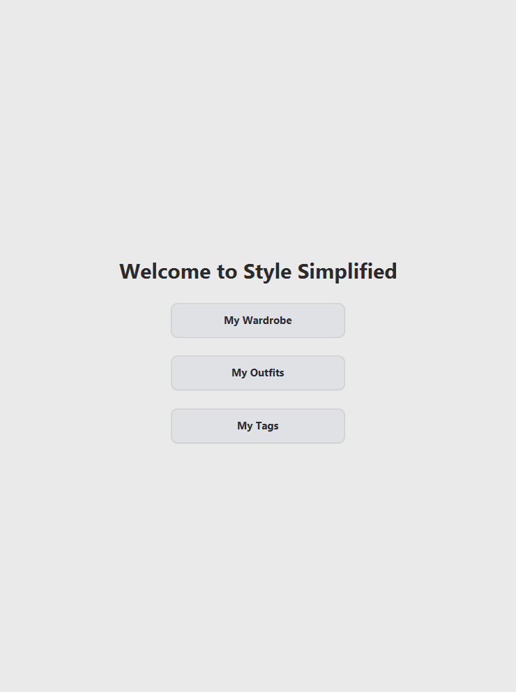

### 2. The Wardrobe
This is your digital closet. You can view all your clothing items, and each item is displayed as a card with its image and name.

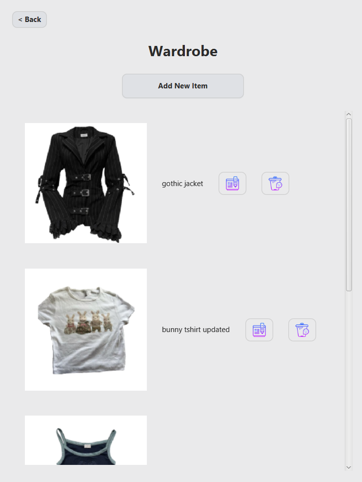

#### Adding a Clothing Item
From the wardrobe, you can navigate to the "Add Item" screen. Here, you can input the item's name, select its type (Top, Bottom, or Accessory), and upload a photo.

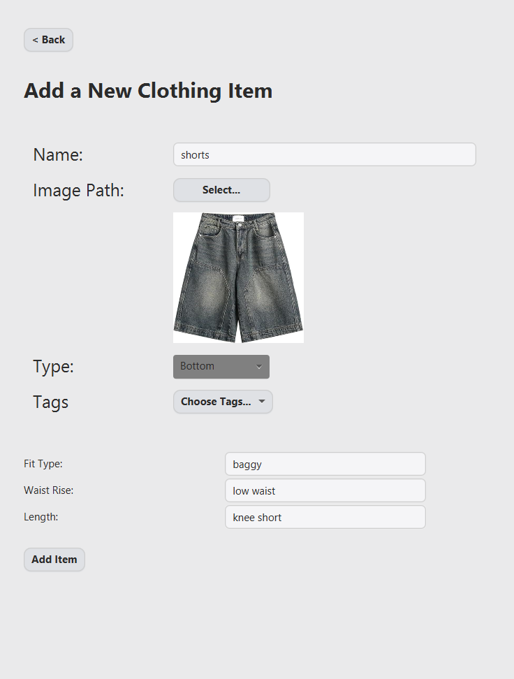

#### Adding Tags to an Item
While adding an item, you can assign existing tags to better categorize your clothes.

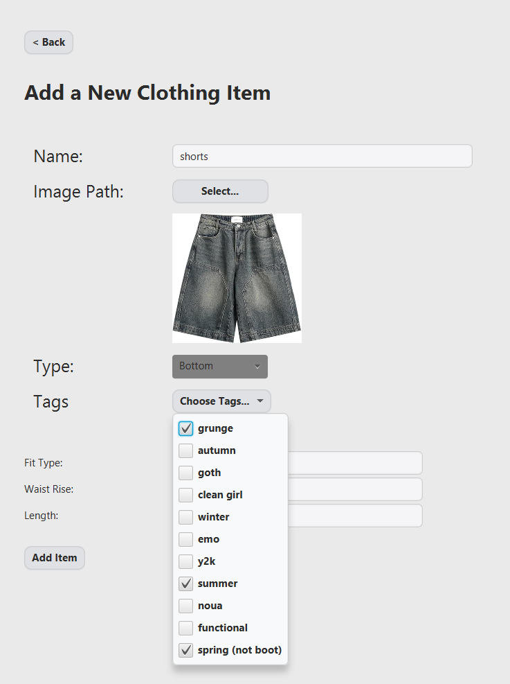

#### Viewing a Clothing Item
By clicking on an item in the wardrobe, you can view its details, including a larger image and all associated tags.

### 3. Outfits
The Outfits section allows you to create, view, and manage your outfits.

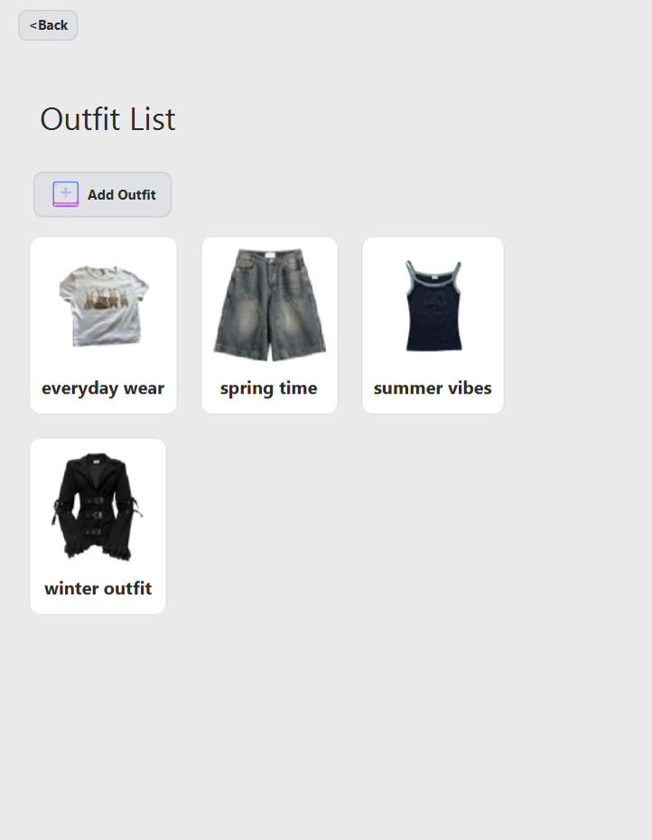

#### Creating a New Outfit
You can create a new outfit by selecting items from your wardrobe. As you add items, a thumbnail of the complete outfit is generated and displayed next to the "Create a New Outfit" button, giving you an instant preview. IF no thumbnail image is chosen, your outfit thumbnail will be defaulted to the first clothing item in the list.

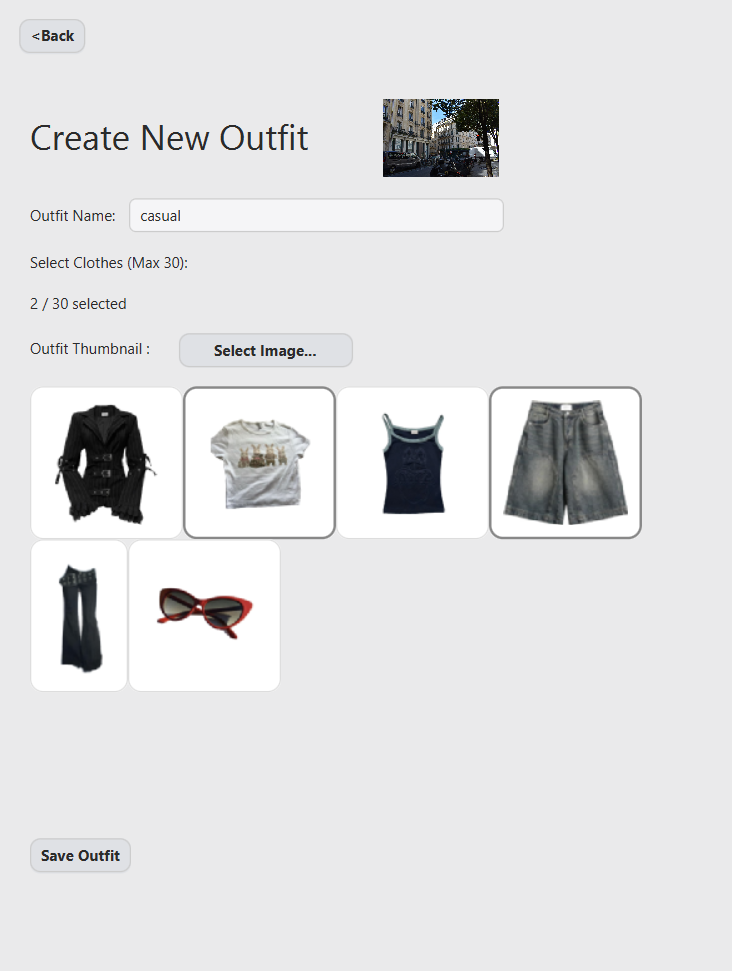

#### Viewing an Outfit
Selecting an outfit from the list will show you all the clothing items that compose it.

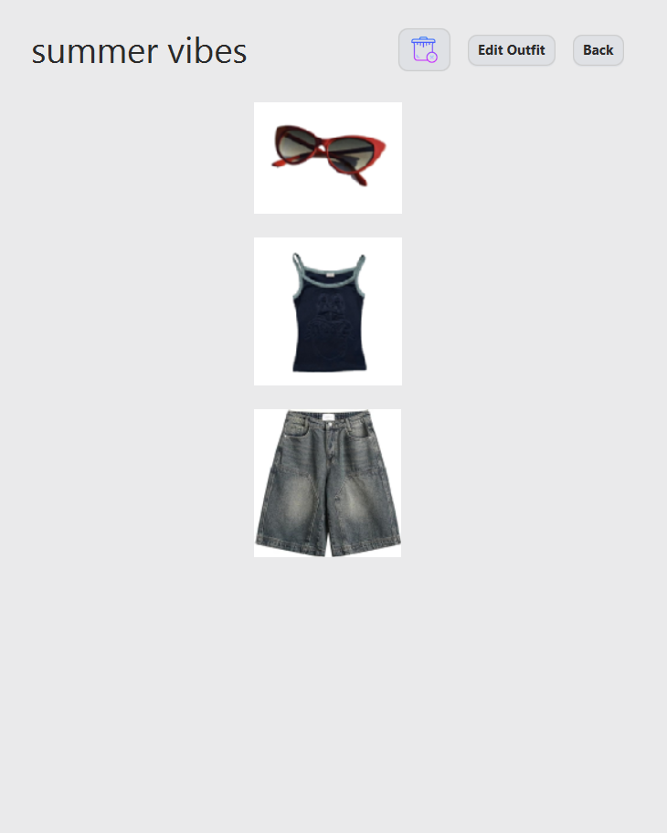

#### Editing an Outfit
You can easily add or remove items from an existing outfit to update its look.

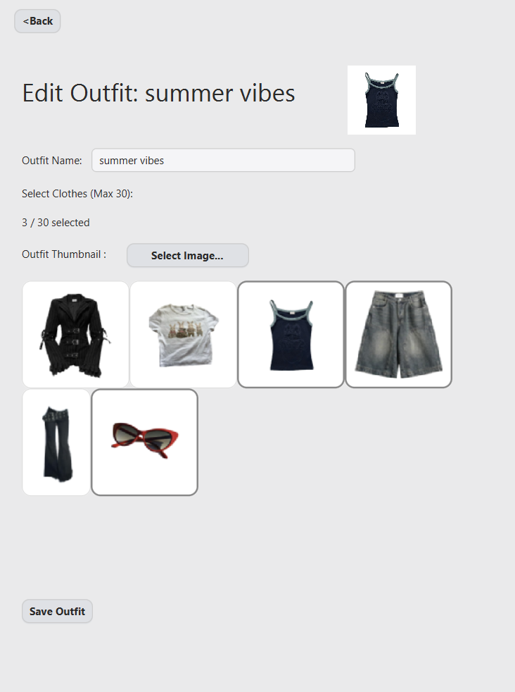

### 4. Tags
Tags are a powerful way to organize your wardrobe. This section allows you to manage all your tags in one place.

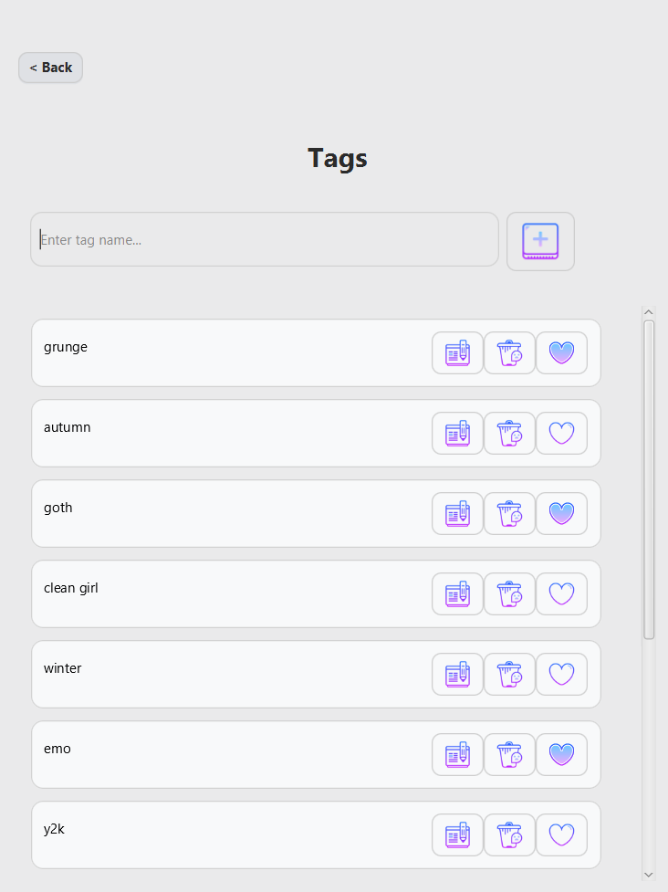

#### Adding a New Tag
You can create new tags, which become available to assign to any clothing item.

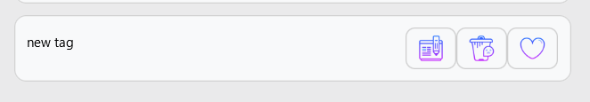

#### Editing a Tag
You can rename existing tags to keep your organization system consistent.

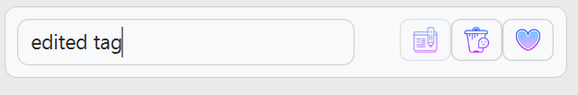

#### Favoriting a Tag
You can mark tags as "favorites," which can be used in the future to prioritize them in search or filter operations.

## Features

- **Comprehensive Wardrobe Management:** Create, view, and organize your clothing items (Tops, Bottoms, Accessories) with custom attributes and images.
- **Outfit Creation & Management:** Combine your clothing items into custom outfits, complete with automatically generated or custom thumbnails. Add, view, and edit these outfits easily.
- **Tagging System:** Organize your wardrobe flexibly using tags. Create new tags, edit existing ones, and mark important ones as favorites. Assign these tags to any clothing item.
- **Persistent Database Backend:** Uses **ORMLite** and a **PostgreSQL** database running in Docker to ensure your data is safely stored and available between sessions. Images are saved locally.
- **Modern User Interface:** A clean, easy-to-navigate JavaFX interface styled with CSS, featuring a minimalist light theme with distinct, easy-to-use controls.

## Built With

- [Java](https://www.java.com/) - The core programming language.
- [JavaFX](https://openjfx.io/) - The modern GUI framework for the user interface.
- [Maven](https://maven.apache.org/) - For project build management and dependencies.
- [PostgreSQL](https://www.postgresql.org/) - The relational database for data storage.
- [Docker](https://www.docker.com/) - For containerizing and managing the database service.
- [ORMLite](http://ormlite.com/) - For object-relational mapping between Java objects and the database.

## Getting Started

To get a local copy up and running, follow these two main steps.

### Prerequisites

- **JDK (Java Development Kit)** - Version 17 or newer.
- **Apache Maven** - To build and run the JavaFX application.
- **Docker Desktop** - Must be installed and running on your system.

### 1. Running the Database Container

First, you need to start the PostgreSQL database. This command will pull the official Postgres image, start a container, and create a persistent volume to save your data even if the container is removed.

Open a terminal and run the following command. **Choose a secure password** and replace `"your_password"` with it.

```sh
docker run --name stylesimplified-db -d \
  -e POSTGRES_PASSWORD=your_password \
  -e POSTGRES_USER=wardrobe_user \
  -e POSTGRES_DB=wardrobe \
  -p 5432:5432 \
  -v stylesimplified_pgdata:/var/lib/postgresql/data \
  postgres
```

- `--name stylesimplified-db`: Gives the container a memorable name.
- `-d`: Runs the container in detached mode (in the background).
- `-e`: Sets environment variables for the database user, password, and name.
- `-p 5432:5432`: Maps the standard PostgreSQL port from your local machine to the container.
- `-v stylesimplified_pgdata...`: Creates a named volume to persist your database data.

To check if the container is running, use `docker ps`.

### 2. Running the Application

Before running the app, ensure your Java code is configured to connect to the database. The connection string in your `WardrobeService` or a similar configuration class should look like this:

`String databaseUrl = "jdbc:postgresql://localhost:5432/wardrobe";`

1.  **Clone the repository:**
    ```sh
    git clone https://your-repository-url.com/StyleSimplified.git
    ```
2.  **Navigate to the project directory:**
    ```sh
    cd StyleSimplified
    ```
3.  **Run the application using Maven:**
    This command will start the JavaFX application, which will then connect to your running Docker container.
    ```sh
    mvn clean javafx:run
    ```

## Project Structure

-   **`src/main/java/com/example/stylesimplified/`**: Main package root for all `.java` source files.
-   **`src/main/resources/com/example/stylesimplified/`**: Contains all non-code resources like `.fxml` and `.css`.
-   **`wardrobe_images/`**: (Created at runtime) Stores copies of all uploaded clothing images.
-   **`pom.xml`**: The Maven project configuration file, listing all dependencies (including `postgresql` and `ormlite-jdbc`).

## Future Improvements

- **Advanced Filtering and Search:**
    - Filter tags by favorites and implement a search function within the tags list.
    - Filter clothing items by type (Top, Bottom, Accessory), by assigned tags, and implement a robust text search in the wardrobe list.
    - Implement filtering and text search for the outfits list.
- **Favorite Outfits:** Add the ability to mark entire outfits as favorites.
- **AI-Powered Item Creation:** Replace the manual input for specific clothing attributes (like waist rise, fit type, and length) with an API call to an online Large Language Model (LLM). This LLM will automatically analyze the item and fill in these details.
- **Standardized Attributes:** Refactor the specific clothing attributes to use predefined choices (e.g., dropdowns) instead of free text. This standardization is a crucial step towards building a robust recommendation engine.
- **Smart Recommendations:** Implement an outfit and item recommendation system. This will utilize:
    - Analysis of the user's favorite outfits and tags.
    - API calls to an online LLM for advanced, context-aware styling suggestions.
